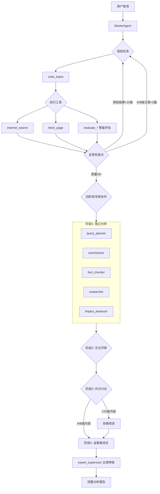

# 热点资讯聚合 Agentic AI

<div align="center">

**基于 LangGraph 和 DeepAgents 的智能新闻分析系统**

[](https://www.python.org/downloads/)
[](https://opensource.org/licenses/MIT)

一个融合**规划（Planning）**、**反思（Reflection）**、**工具使用（Tool Use）**、**多智能体协作（MAC）**四大 Agentic AI 范式的智能新闻分析系统。

[快速开始](#快速开始) • [功能特性](#功能特性) • [架构设计](#架构设计) • [使用文档](#使用文档) • [开发指南](#开发指南)

</div>

---

## 📋 目录

- [功能特性](#功能特性)
- [快速开始](#快速开始)
- [使用方式](#使用方式)
- [架构设计](#架构设计)
- [配置说明](#配置说明)
- [开发指南](#开发指南)
- [测试](#测试)
- [项目结构](#项目结构)
- [文档](#文档)

---

## ✨ 功能特性

### 🧠 四大 Agentic AI 范式

| 范式 | 实现方式 | 核心能力 |
|------|---------|---------|
| **规划（Planning）** | `write_todos` / `read_todos` | Agent 自主规划任务清单，分步执行 |
| **反思（Reflection）** | 系统提示词 + 检查点 | 主动评估结果质量，调整策略 |
| **工具使用（Tool Use）** | 自定义工具 + LangChain 集成 | 搜索、抓取、评估等领域工具 |
| **多智能体协作（MAC）** | `task()` + 四阶段专家协作 | 异构专家独立分析、交叉评审、共识讨论 |

### 🎭 四阶段异构专家协作机制（LLM Council 启发）

借鉴 [Andrej Karpathy 的 LLM Council](https://github.com/karpathy/llm-council) 项目，针对**异构专家**（不同职责的 Agent）设计的协作机制：

```
阶段 1：独立分析（First Opinions）
   ↓  各专家基于自身职责独立产出分析
阶段 2：交叉评审（Cross-Review）
   ↓  专家之间根据评审矩阵相互审核
阶段 3：共识讨论（Consensus Discussion）
   ↓  针对评级 C/D 的内容进行协商改进
阶段 4：监督者综合（Chairman Synthesis）
   ↓  Expert Supervisor 作为主席整合最终结论
```

**交叉评审矩阵**：
| 评审者 | 被评审者 | 评审重点 |
|--------|----------|----------|
| Fact Checker | Summarizer | 事实准确性 |
| Researcher | Fact Checker | 历史背景 |
| Impact Assessor | Researcher | 影响评估 |
| Summarizer | Impact Assessor | 表达清晰度 |

### 📊 等级评估系统（A/B/C/D）

使用直观的等级制（而非数值分数）评估信息质量：

| 等级 | 含义 | 应用场景 |
|------|------|----------|
| **A** | 优秀 | 可直接采信，纳入最终报告 |
| **B** | 良好 | 可采信，但建议补充说明 |
| **C** | 一般 | 需改进，触发共识讨论 |
| **D** | 不足 | 需重做或剔除 |

### 🔧 核心功能

- **智能搜索**：通过 Tavily API 进行互联网搜索
- **内容抓取**：使用 httpx + BeautifulSoup4 提取网页核心内容
- **质量评估**：自动评估信息的可信度和相关性
- **专家分析**（六大专家 Agent）：
  - 📋 **查询规划专家**：生成 6-10 条多样化搜索查询（核心、细节、多元、补充）
  - 📝 **摘要专家**：深度提取核心要点，避免泛泛而谈
  - ✅ **事实核查专家**：验证关键声明，提供可信度等级
  - 🔍 **背景研究专家**：补充历史上下文与行业背景
  - 📊 **影响评估专家**：分析短期/长期影响与趋势
  - 🎯 **专家监督者**：作为"主席"综合各专家意见，确保报告质量
- **报告生成**：自动生成完整的 Markdown 格式分析报告（确保不中断、不询问）

### 🎯 适用场景

- 🗞️ **日常热点追踪**：快速了解特定领域的最新动态
- 📈 **市场分析**：跟踪行业趋势和竞品动态
- 🔬 **研究辅助**：收集和整理特定主题的信息
- 📊 **竞品情报**：监控竞争对手的产品和战略

---

## 🚀 快速开始

### 前置要求

- Python 3.11+
- [uv](https://github.com/astral-sh/uv)（推荐）或 pip

### 安装

```bash
# 1. 克隆仓库
git clone https://github.com/yourusername/news-report-agent.git
cd news-report-agent

# 2. 使用 uv 安装依赖（推荐）
uv sync

# 或使用 pip
pip install -e .
```

### 配置

```bash
# 1. 复制配置文件
cp env.example .env

# 2. 编辑 .env，填入你的 API keys
# 至少需要配置：
#   - OPENAI_API_KEY 或 Azure OpenAI 配置
#   - TAVILY_API_KEY（搜索）
```

**配置示例**：

```bash
# OpenAI (推荐用于开发)
OPENAI_API_KEY=sk-proj-xxxxxxxxxxxxxxxxxxxxx

# Azure OpenAI (推荐用于生产)
AZURE_OPENAI_API_KEY=your_azure_key
AZURE_OPENAI_ENDPOINT=https://your-resource.openai.azure.com
# 注意：这里是你的 Azure “部署名”（deployment name），不是模型名
AZURE_OPENAI_DEPLOYMENT_NAME=your_deployment_name

# 搜索工具（必需）
TAVILY_API_KEY=tvly-xxxxxxxxxxxxxxxxxxxxx
```

> 💡 **更多设计与实现细节**：查看 [PROJECT_OVERVIEW.md](PROJECT_OVERVIEW.md) / [TECHNICAL_DESIGN.md](TECHNICAL_DESIGN.md)

### 验证安装

```bash
# 检查配置
uv run python check_env.py

# 运行测试
uv run pytest tests/ -v
```

---

## 💡 使用方式

### 命令行方式（推荐）

```bash
# 基础用法
uv run python -m cli.main "今天AI领域有什么重要进展"

# 指定领域
uv run python -m cli.main --domain technology "最新科技新闻"

# 输出到文件
uv run python -m cli.main --output ./reports/today.md "OpenAI最新动态"

# 详细日志
uv run python -m cli.main --verbose "分析特斯拉股价"

# 启用 checkpoint（适合长任务/可复用同一主题的状态）
uv run python -m cli.main --checkpoint --thread-id "daily-ai" "今天AI领域有什么重要进展"

# 使用已安装的命令（见 pyproject.toml 的 [project.scripts]）
news-agent "今天有什么AI新闻"
```

### Python API 方式

```python
from src.agent import create_news_agent

# 创建 Agent
agent = create_news_agent()

# 执行查询
result = agent.invoke({
    "messages": [{"role": "user", "content": "分析今天AI领域的热点"}]
})

# 获取结果
print(result["messages"][-1].content)
```

### 高级用法

```python
from datetime import datetime
from src.agent import create_news_agent
from src.config import load_settings, create_chat_model, ModelConfig

# 1. 自定义模型
config = load_settings()
custom_model_config = ModelConfig(
    model="gpt-4o-mini",
    provider=config.model_map["master"].provider,
    temperature=0.7,
    max_tokens=2000
)
custom_model = create_chat_model(custom_model_config, config)

agent = create_news_agent(model_override=custom_model)

# 2. 指定时间上下文
agent = create_news_agent(current_datetime=datetime(2024, 1, 1))

# 3. 添加自定义工具
from langchain_core.tools import tool

@tool
def custom_tool(query: str) -> str:
    """自定义工具"""
    return f"处理: {query}"

agent = create_news_agent(additional_tools=[custom_tool])
```

---

## 🏗️ 架构设计

### 系统架构

```
用户查询
   ↓
MasterAgent (主Agent)
   ├── 规划：write_todos（任务分解）
   ├── 工具：internet_search, fetch_page, evaluate_*
   ├── 反思：检查点评估（≥15条原始结果，≥5条 A/B 级）
   └── 协作：四阶段异构专家协作
          │
          ├── 阶段 1：独立分析
          │   ├── query_planner (查询规划)
          │   ├── summarizer (摘要)
          │   ├── fact_checker (事实核查)
          │   ├── researcher (背景研究)
          │   └── impact_assessor (影响评估)
          │
          ├── 阶段 2：交叉评审
          │   └── 专家间依据评审矩阵相互审核
          │
          ├── 阶段 3：共识讨论
          │   └── 针对 C/D 级内容协商改进
          │
          └── 阶段 4：监督者综合
              └── expert_supervisor (主席) 整合最终结论
   ↓
完整分析报告（Markdown）
```

### 工作流程



### 技术栈

| 类别 | 技术 |
|------|------|
| **Agent 框架** | [DeepAgents](https://github.com/cyzus/deepagents), LangGraph |
| **LLM 接口** | LangChain, OpenAI API, Azure OpenAI, **Google Gemini** |
| **搜索** | Tavily API |
| **抓取** | httpx, BeautifulSoup4 |
| **数据模型** | Pydantic v2 |
| **测试** | pytest |
| **日志** | loguru |

---

## ⚙️ 配置说明

### 环境变量

| 变量名 | 说明 | 必需 | 默认值 |
|-------|------|------|--------|
| `OPENAI_API_KEY` | OpenAI API 密钥 | 二选一 | - |
| `AZURE_OPENAI_API_KEY` | Azure OpenAI API 密钥 | 二选一 | - |
| `AZURE_OPENAI_ENDPOINT` | Azure OpenAI 端点 | Azure 必需 | - |
| `AZURE_OPENAI_DEPLOYMENT_NAME` | Azure 部署名称 | Azure 必需 | - |
| `GEMINI_KEY` | Google Gemini API 密钥 | ❌ | - |
| `MODEL_GEMINI_3_FLASH` | Gemini 模型名称 | ❌ | - |
| `TAVILY_API_KEY` | Tavily 搜索 API 密钥 | ✅ | - |
| `BRAVE_API_KEY` | Brave 搜索 API 密钥 | ❌ | - |
| `FIRECRAWL_API_KEY` | Firecrawl 抓取 API 密钥 | ❌ | - |
| `NEWS_AGENT_FS_BASE` | 文件系统基础目录 | ❌ | `./data` |

### 模型配置

默认模型在 `src/config.py` 的 `default_model_map()` 中定义：
- **OpenAI 模式**：默认 `master=gpt-4o`，其余角色按需使用 `gpt-4o-mini/gpt-4o`
- **Azure 模式**：当设置了 `AZURE_OPENAI_*` 后，会优先使用 Azure；并使用 `AZURE_OPENAI_DEPLOYMENT_NAME` 作为各角色的部署名
- **混合模式（推荐）**：Master Agent 使用 OpenAI/Azure，专家 Agent 使用 Gemini（配置 `GEMINI_KEY` 和 `MODEL_GEMINI_3_FLASH`）

```python
# src/config.py
from src.config import default_model_map

# 纯 OpenAI 模式
model_map = default_model_map(provider="openai")

# 混合模式：Master 用 OpenAI，专家用 Gemini
model_map = default_model_map(
    provider="openai",
    expert_provider="google",
    expert_model="gemini-2.5-flash"
)
# 角色包括：master / summarizer / fact_checker / researcher / impact_assessor
```

### 使用 Gemini 作为专家模型

推荐使用 Google Gemini 作为专家 Agent 的模型，以获得更好的性价比：

```bash
# .env 配置
OPENAI_API_KEY=sk-xxx          # Master Agent 使用
GEMINI_KEY=AIzaSy...           # 专家 Agent 使用
MODEL_GEMINI_3_FLASH=gemini-2.5-flash
```

**支持的 Gemini 模型**：
- `gemini-2.5-flash` - 最新版本，推荐使用
- `gemini-2.0-flash` - 稳定版本
- `gemini-1.5-flash` - 经济型
- `gemini-1.5-pro` - 高性能

> 获取 Gemini API Key: https://aistudio.google.com/app/apikey

---

## 🛠️ 开发指南

### 项目结构

```
news-report-agent/
├── src/
│   ├── agent/                    # Agent 核心
│   │   ├── master.py             # MasterAgent 工厂函数
│   │   ├── prompts.py            # 系统提示词
│   │   ├── subagents.py          # 专家子Agent配置
│   │   ├── expert_council.py     # 四阶段专家协作 - 交叉评审
│   │   └── discussion_coordinator.py  # 四阶段专家协作 - 协调器
│   ├── tools/                    # 自定义工具
│   │   ├── search.py             # 互联网搜索
│   │   ├── scraper.py            # 网页抓取
│   │   └── evaluator.py          # 内容评估（A/B/C/D等级）
│   ├── utils/                    # 工具函数
│   │   ├── logger.py             # 日志配置
│   │   └── templates.py          # 报告模板
│   ├── config.py                 # 配置管理
│   └── models.py                 # 数据模型（含 Grade 等级枚举）
├── cli/
│   └── main.py                   # CLI 入口
├── docs/
│   └── EXPERT_COUNCIL_DESIGN.md  # 专家协作机制设计文档
├── tests/                        # 测试
│   ├── agent/
│   ├── tools/
│   ├── integration/
│   └── ...
└── *.md                          # 项目文档（在仓库根目录）
```

### 添加自定义工具

```python
# 1. 在 src/tools/ 创建新工具
from langchain_core.tools import tool

@tool
def my_custom_tool(param: str) -> str:
    """工具描述"""
    try:
        # 实现逻辑
        result = do_something(param)
        return result
    except Exception as e:
        return f"错误: {str(e)}"

# 2. 在 src/tools/__init__.py 中导出
from .my_tool import my_custom_tool
__all__ = [..., "my_custom_tool"]

# 3. 注册到 Agent
from src.agent import create_news_agent
from src.tools import my_custom_tool

agent = create_news_agent(additional_tools=[my_custom_tool])
```

### 添加新的专家子Agent

编辑 `src/agent/subagents.py`：

```python
{
    "name": "my_expert",
    "description": "专家描述",
    "system_prompt": "你是...专家，负责...",
    "tools": resolve_tools(["internet_search"]),  # 可用工具
    "model": create_chat_model(expert_model_config, config),
}
```

---

## 🧪 测试

### 运行所有测试

```bash
# 快速测试（跳过集成测试）
uv run pytest tests/ -v

# 包含集成测试（需要真实 API keys）
uv run pytest tests/ -v --run-integration
```

### 测试覆盖

```bash
# 生成覆盖率报告
uv run pytest tests/ --cov=src --cov-report=html

# 查看报告
open htmlcov/index.html
```

### 单元测试示例

```python
# tests/test_custom_tool.py
def test_my_custom_tool():
    from src.tools import my_custom_tool
    
    result = my_custom_tool.invoke({"param": "test"})
    assert "expected" in result
```

---

## 📚 文档

| 文档 | 说明 |
|------|------|
| [PROJECT_OVERVIEW.md](PROJECT_OVERVIEW.md) | 项目完整介绍（推荐先读） |
| [TECHNICAL_DESIGN.md](TECHNICAL_DESIGN.md) | 技术设计文档 |
| [IMPLEMENTATION_PLAN.md](IMPLEMENTATION_PLAN.md) | 实现计划 |
| [TESTING_GUIDE.md](TESTING_GUIDE.md) | 测试指南 |
| [DATETIME_CONTEXT.md](DATETIME_CONTEXT.md) | 时间上下文注入说明（"今天/近期/最新"解释） |
| [EXPERT_SUPERVISOR.md](EXPERT_SUPERVISOR.md) | 专家主管审核流程与规范 |
| [docs/EXPERT_COUNCIL_DESIGN.md](docs/EXPERT_COUNCIL_DESIGN.md) | **四阶段异构专家协作机制设计**（LLM Council 启发） |

---

## 🤝 贡献

欢迎贡献代码、报告问题或提出建议！

```bash
# 1. Fork 项目
# 2. 创建特性分支
git checkout -b feature/amazing-feature

# 3. 提交更改
git commit -m 'Add amazing feature'

# 4. 推送到分支
git push origin feature/amazing-feature

# 5. 创建 Pull Request
```

---

## 📄 许可证

MIT License - 详见 [LICENSE](LICENSE) 文件

---

## 🙏 致谢

- [DeepAgents](https://github.com/cyzus/deepagents) - Agent 框架
- [LangChain](https://github.com/langchain-ai/langchain) - LLM 抽象层
- [LangGraph](https://github.com/langchain-ai/langgraph) - Agent 工作流
- [Tavily](https://tavily.com/) - 搜索 API
- [LLM Council](https://github.com/karpathy/llm-council) - 多 LLM 协作机制启发（Andrej Karpathy）

---

## 📮 联系方式

- 项目主页：[news-report-agent](https://github.com/yourusername/news-report-agent)
- 问题反馈：[Issues](https://github.com/yourusername/news-report-agent/issues)

---

<div align="center">

Made with love by [Your Name]

</div>
