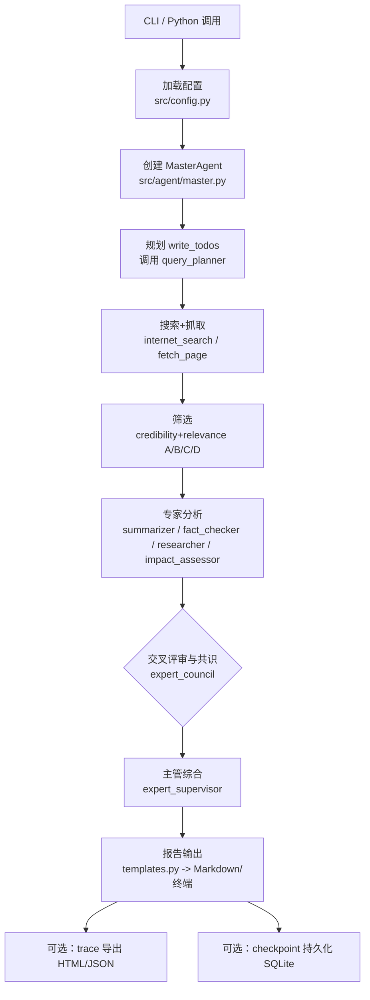

# Agent 运行流程概览（中文）

面向贡献者的端到端执行说明：从接收查询到输出 Markdown 报告的完整路径。

## 总览流程图

## 关键阶段与责任
1) **入口**  
   - CLI：`python -m cli.main ...` / `news-agent ...`，解析 `--domain/--output/--trace/--checkpoint/--thread-id`。  
   - API：`create_news_agent()` 或 `create_news_agent_with_checkpointing()`。

2) **配置与模型**（`src/config.py`）  
   - 读取 `.env`：OpenAI 或 Azure；可选 Gemini 供专家用。  
   - 生成每个角色的 `ModelConfig`，文件系统根目录默认为 `./data`（可由 `NEWS_AGENT_FS_BASE` 覆盖）。

3) **MasterAgent 构建**（`src/agent/master.py`）  
   - 注入当前日期时间到 `MASTER_AGENT_SYSTEM_PROMPT`。  
   - 挂载工具：`internet_search`、`fetch_page`、`evaluate_credibility`、`evaluate_relevance` + DeepAgents 内置（write_todos/read_todos、task、文件系统）。  
   - 装配子 Agent（`src/agent/subagents/`），支持结构化输出。

4) **规划与反思**（`src/prompts/master.py`）  
   - 首要动作：调用 `query_planner` 生成 6–10 组多样化查询。  
   - 反思检查点：搜索后、筛选后、专家分析后；不足时强制补检索/补分析。

5) **搜索与筛选**（`src/tools/`）  
   - Tavily 搜索：每个查询 8–10 条候选，可带 `topic="news"`。  
   - 抓取：`fetch_page`/`fetch_page_async` 拉取全文。  
   - 评分：`evaluate_credibility` + `evaluate_relevance` 产出 A/B/C/D，保留 5–8 条高质量内容。

6) **专家分析**（`subagents/*.py` + `src/schemas/outputs.py`）  
   - 并行角色：`summarizer`、`fact_checker`、`researcher`、`impact_assessor`；默认 Pydantic 结构化输出。  
   - `expert_supervisor` 负责整合与质量裁决。

7) **专家委员会（可选全流程）**  
   - `expert_council`（`subagents/council.py` + `agent/council/matrix.py`）：独立分析 → 交叉评审 → 共识讨论（关注 C/D 项） → 主管综合，返回 Markdown 报告片段。  
   - **交叉评审细节**：  
     - 评审关系：  
       - summarizer ⇢ fact_checker（准确性）、researcher（完整性）、impact_assessor（覆盖关键要素）  
       - fact_checker ⇢ researcher（证据/完整性）、summarizer（一致性）  
       - researcher ⇢ fact_checker（准确性/证据）、impact_assessor（逻辑/完整性）  
       - impact_assessor ⇢ researcher（证据/逻辑）、fact_checker（准确性/逻辑）  
     - 输出：每条评审附 overall_grade（A/B/C/D）、问题与建议。C/D 会被标记为冲突，进入共识讨论，之后由 expert_supervisor 做最终裁决。

8) **报告与持久化**  
   - 渲染：`src/utils/templates.py` 生成终端预览与 Markdown；CLI `--output` 写入文件。  
   - 追踪：`--trace` 实时 Rich 树状视图，`--trace-output` 导出 `.html/.json`（`src/utils/tracer.py`）。  
   - 状态：`--checkpoint` 将状态写入 `<NEWS_AGENT_FS_BASE>/checkpoints/agent_state.db`（SQLite），使用相同 `thread_id` 续跑。

## 产物与路径约定
- 默认根：`./data`（可通过 `NEWS_AGENT_FS_BASE` 重定向）。  
- 检查点：`./data/checkpoints/agent_state.db`。  
- 报告：通常写入 `./reports/*.md` 或 CLI `--output` 指定路径。  
- 反思记录：`/reflection/checkpoint_*.md`（DeepAgents 虚拟 FS）。  
- 追踪导出：`--trace-output` 指定，若目录不存在会自动创建。
